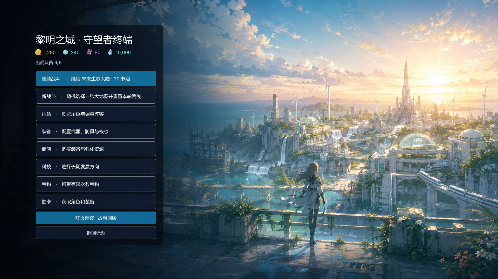
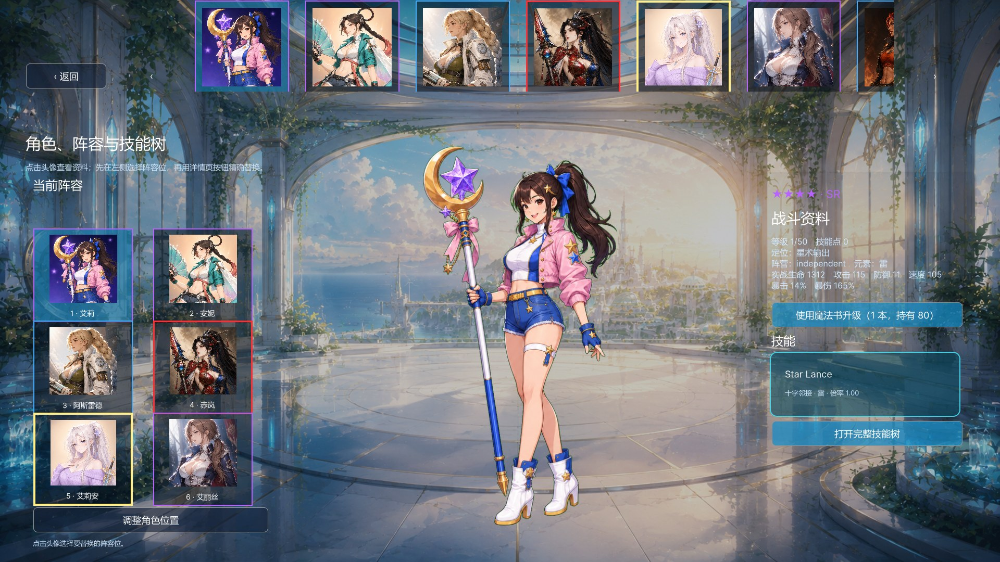
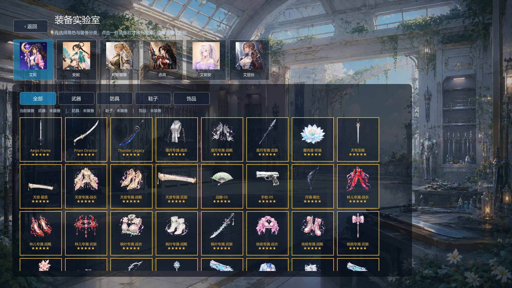
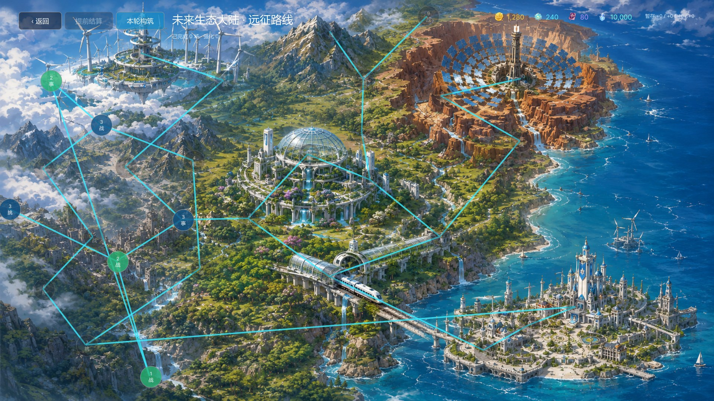
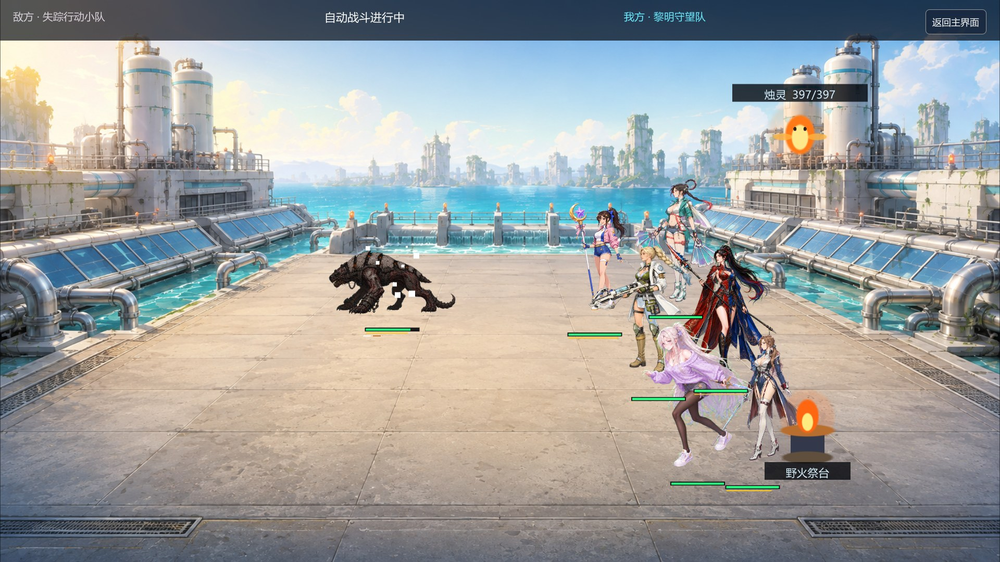
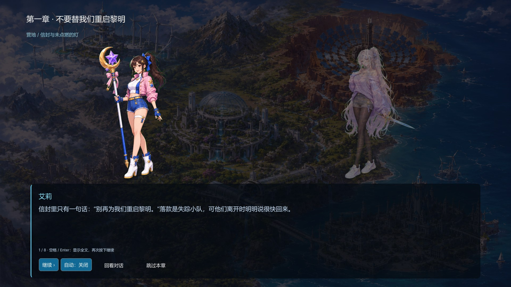

# Blade of Love

**黎明之城的守望者**

在废墟与新生之间，带着六人的队伍，寻找不必重启的明天。

*An elemental squad-building roguelite, set in a world learning to see another dawn.*

[游戏特色](#游戏特色) · [实机画面](#实机画面) · [玩法详解](docs/showcase/GAMEPLAY.md) · [当前进度](#当前进度与公开范围)

## 游戏特色

**Blade of Love** 是一款正在开发中的 PC 横版编队自动战斗肉鸽游戏。选择角色、安排 3×2 阵型、搭配装备与祝福，再沿大地图探索战斗、商人和旅途事件。决定胜负的不只有一次技能的伤害，也有元素附着的顺序、队伍的行动节奏，以及谁掌握了战场装置。

- **六人编队与角色构筑**：配置阵型、目标策略、装备与技能成长，让不同角色组成能互相支持的队伍。
- **七种元素相互作用**：水、火、冰、雷、毒、风、土参与附着与反应；让潮湿、燃烧、冻结和导电成为战术的一部分。
- **祝福改变打法**：护盾接力、治疗转盾、反应回能、普攻蓄势，搭配带前置的组合祝福；蓝色祝福也能带来新机制。
- **战场本身也会改变**：烛灵分担伤害，祭台独立发射火球；涨潮让双方潮湿，黑夜扰乱索敌，引路灯则重新照亮目标。
- **争夺，而不只是输出**：通过施法抢占灵泉、覆盖回声碑记录，或在落星预警到来前安排好防护。
- **沿途的选择留下影响**：向商人打听消息、购买或解除祝福，在事件中交换资源、承担风险，选择自己的远征路线。
- **一次次出发，也一次次记住**：24 章主线与 5 段战败／重来剧情，以角色对话推进调查、救援和灯网重建。

## 实机画面

以下均来自 **Unity 开发版实际运行截图**，使用独立展示存档。界面、美术与数值仍在迭代，部分场地造物和剧情背景使用占位素材。

### 角色与编队

查看角色资料、配置六人阵容，并通过技能树和装备形成不同的战斗定位。

### 装备与成长

武器、防具、鞋与核心组成角色的装备配置。装备成长和专属适配，与局内祝福共同影响构筑。

### 大地图与远征路线

战斗、挑战、补给、事件与首领组成探索路线。新加入的工坊和遗迹实验室，可以体验独立造物与场地装置。

### 自动战斗与战场装置

角色按行动时间线作战，技能演出期间冻结结算时钟。编队以外的召唤物与场地装置，为同一支队伍带来不同的解法。

### 灯火档案与角色对话

从一封“不要重启黎明”的信开始，寻找失踪小队与旧塔协议的真相。双全身立绘、逐字对白、自动阅读和故事回顾共同呈现旅途。

## 一轮远征如何进行

**准备阵容 → 选择路线 → 战斗与事件 → 获取祝福、调整构筑 → 挑战首领 → 带着成长重新出发。**

角色和装备成长保留在营地；每轮远征重新选择临时祝福和事件。战败通过应急灯标救援与休整解释，故事不会因重新出发而被抹去。

更多机制与例子见 [玩法详解](docs/showcase/GAMEPLAY.md)。

## 当前进度与公开范围

本地开发版本：**0.29.0**。已实现 24 章主线、3 段战败幕、2 段重来幕，约万字、232 段对白，覆盖全部 11 位五星角色。构筑目录包含 31 种祝福，其中 21 种带有机制效果；旅途事件与两张地图持续扩充中。

**这个公开仓库目前是轻量展示仓库**：包含介绍、玩法说明与精选实机截图。完整 Unity 制作工程、大型图集、原始素材包、授权音频和本地存档未随本次上传；目前也未提供可下载发行版。克隆此仓库不会得到可直接运行的完整游戏。

后续重点包括专属剧情场景、造物正式美术、更多事件组合，以及长期平衡与表现优化。开发信息见 [项目说明](docs/showcase/DEVELOPMENT.md)。

## 反馈与素材说明

欢迎通过 [GitHub Issues](https://github.com/codeishardlol/BladeofLove/issues) 反馈体验建议、构筑想法和希望看到的机制。

部分美术使用 AI 辅助制作，并结合人工筛选与接入。展示图不包含原始素材包；第三方授权音频不在此分发。当前未授予本仓库游戏素材的独立再分发许可。
